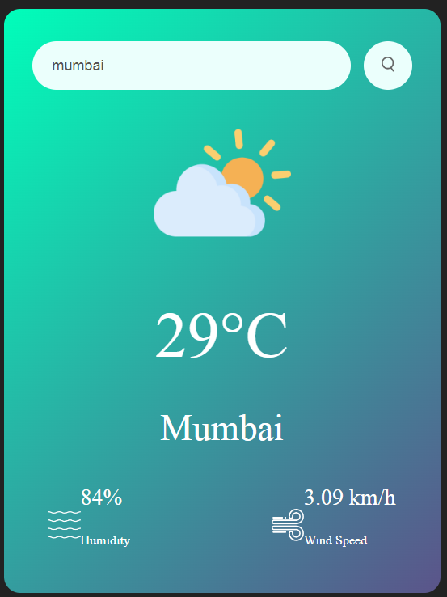
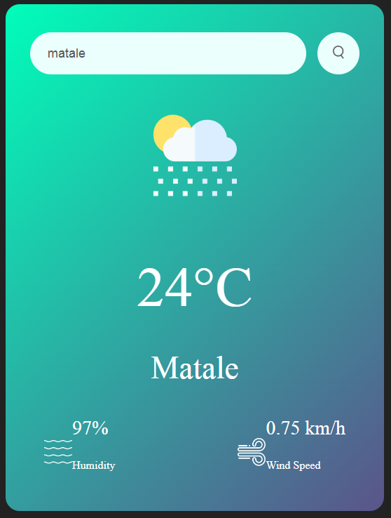
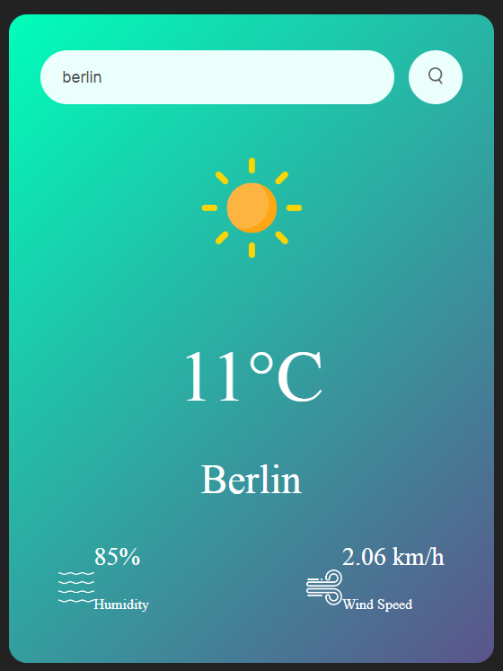

# Simple Weather App

This is a simple weather app built using HTML, CSS, and JavaScript. It allows users to check the current weather conditions of any city by entering its name.

## Features

- User-friendly interface
- Real-time weather updates
- Displays temperature, city name, humidity, and wind speed

## Screenshots
 
 
 
 

 

## Resources

- [OpenWeatherMap API](https://openweathermap.org/api) - Used to fetch weather data.

